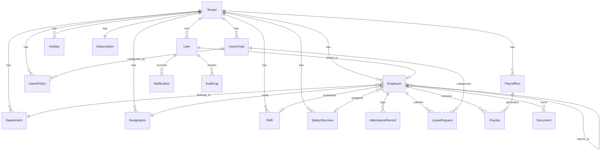

# 🗄️ DATABASE SCHEMA REFERENCE

## Overview
- **ORM**: Prisma 7.x
- **Dev Database**: SQLite (`backend/prisma/dev.db`)
- **Prod Database**: PostgreSQL 16 (swap by changing `datasource` provider)
- **Models**: 18 tables
- **Tenant Isolation**: Every table has `tenantId` column

---

## Entity Relationship Diagram

---

## Table Details

### 1. `tenants` — Company / Organization
| Column | Type | Description |
|---|---|---|
| id | UUID (PK) | Tenant identifier |
| name | String | Company name |
| subdomain | String (UNIQUE) | URL subdomain (e.g., 'acme') |
| logoUrl | String? | Company logo path |
| settings | JSON | Branding, locale, features config |
| timezone | String | Default: 'UTC' |
| currency | String | Default: 'USD' |
| country | String? | ISO country code |
| status | String | active / suspended / cancelled |

### 2. `users` — Authentication Accounts
| Column | Type | Description |
|---|---|---|
| id | UUID (PK) | |
| tenantId | UUID (FK) | |
| email | String | Login email (unique per tenant) |
| passwordHash | String | bcrypt hash |
| role | String | super_admin / company_admin / hr_manager / manager / employee |
| isActive | Boolean | Account enabled |
| isVerified | Boolean | Email verified |
| failedLoginAttempts | Int | For lockout (locks after 5) |
| lockedUntil | DateTime? | Lockout expiry |
| refreshTokenHash | String? | Hashed refresh token |

### 3. `employees` — Core Employee Records
| Column | Type | Description |
|---|---|---|
| id | UUID (PK) | |
| tenantId | UUID (FK) | |
| userId | UUID? (FK, UNIQUE) | Linked auth account |
| employeeCode | String | Auto-generated (NEX-0001) |
| firstName, lastName | String | |
| email | String | Work email |
| phone | String? | |
| dateOfBirth | DateTime? | |
| gender | String? | male / female / other |
| address, city, state, country, zipCode | String? | |
| departmentId | UUID? (FK) | |
| designationId | UUID? (FK) | |
| reportingManagerId | UUID? (FK → employees) | Self-referencing |
| salaryStructureId | UUID? (FK) | |
| shiftId | UUID? (FK) | |
| dateOfJoining | DateTime | |
| employmentType | String | full_time / part_time / contract / intern |
| status | String | active / probation / on_leave / terminated / resigned |
| emergencyContact | JSON | {name, phone, relation} |
| bankDetails | JSON | {bank, account, ifsc} |

### 4. `departments`
| Column | Type | Description |
|---|---|---|
| id | UUID (PK) | |
| tenantId | UUID (FK) | |
| name | String | Unique per tenant |
| code | String? | Short code (ENG, HR) |
| headId | UUID? (FK → employees) | Department head |
| parentId | UUID? (FK → departments) | Hierarchy |

### 5. `designations`
| Column | Type | Description |
|---|---|---|
| id | UUID (PK) | |
| tenantId | UUID (FK) | |
| name | String | Unique per tenant |
| level | Int | 1=junior → 9=CXO |

### 6. `shifts`
| Column | Type | Description |
|---|---|---|
| id | UUID (PK) | |
| tenantId | UUID (FK) | |
| name | String | e.g., "General Shift" |
| startTime | String | "09:00" |
| endTime | String | "18:00" |
| graceMinutes | Int | Default: 15 |
| isDefault | Boolean | |

### 7. `attendance_records`
| Column | Type | Description |
|---|---|---|
| id | UUID (PK) | |
| tenantId | UUID (FK) | |
| employeeId | UUID (FK) | |
| date | DateTime | Attendance date |
| checkIn | DateTime? | Clock-in time |
| checkOut | DateTime? | Clock-out time |
| hoursWorked | Float? | Auto-calculated |
| status | String | present / absent / late / half_day / holiday / weekend |
| source | String | web / mobile / biometric |
| **Unique**: (tenantId, employeeId, date) | | One record per employee per day |

### 8. `leave_types`
| Column | Type | Description |
|---|---|---|
| id | UUID (PK) | |
| tenantId | UUID (FK) | |
| name | String | e.g., "Casual Leave" |
| code | String | e.g., "CL" (unique per tenant) |
| isPaid | Boolean | |
| color | String | Hex color for UI |

### 9. `leave_policies`
| Column | Type | Description |
|---|---|---|
| id | UUID (PK) | |
| tenantId | UUID (FK) | |
| leaveTypeId | UUID (FK) | |
| annualQuota | Float | Days per year |
| maxCarryForward | Float | |
| allowNegative | Boolean | |
| accrualType | String | yearly / monthly / quarterly |

### 10. `leave_requests`
| Column | Type | Description |
|---|---|---|
| id | UUID (PK) | |
| tenantId, employeeId, leaveTypeId | UUID (FKs) | |
| startDate, endDate | DateTime | |
| days | Float | Supports half-days |
| status | String | pending / approved / rejected / cancelled |
| reviewedBy | String? | Who approved/rejected |

### 11. `holidays`
| Column | Type | Description |
|---|---|---|
| name | String | Holiday name |
| date | DateTime | |
| isOptional | Boolean | |

### 12. `salary_structures`
| Column | Type | Description |
|---|---|---|
| name | String | e.g., "Senior Developer Package" |
| baseSalary | Float | |
| allowances | JSON | [{name, type, value}] |
| deductions | JSON | [{name, type, value}] |

### 13. `payroll_runs`
| Column | Type | Description |
|---|---|---|
| month, year | Int | Unique per tenant |
| status | String | draft / processing / completed / reversed |
| totalEmployees, totalGross, totalDeductions, totalNet | Number | |
| processedBy | String? | User ID |

### 14. `payslips`
| Column | Type | Description |
|---|---|---|
| employeeId, payrollRunId | UUID (FKs) | |
| grossSalary, totalDeductions, tax, netSalary | Float | |
| earnings, deductionsDetail | JSON | Breakdown arrays |
| workingDays, daysWorked, lopDays | Number | |

### 15-18. `documents`, `notifications`, `subscriptions`, `audit_logs`
See `backend/prisma/schema.prisma` for full definitions.

---

## Seed Data (Created on Registration)

When a tenant registers, the system automatically creates:

| Entity | Seeds |
|---|---|
| **Departments** | General, Engineering, HR, Finance, Marketing, Sales, Design, Support |
| **Designations** | Intern(1), Junior Dev(2), Mid Dev(3), Senior Dev(4), Lead(5), Manager(6), Director(7), VP(8), CXO(9) |
| **Leave Types** | Casual(CL, 12d), Sick(SL, 6d), Earned(EL, 15d), Unpaid(UL, unlimited) |
| **Shift** | General Shift (09:00-18:00, 15min grace) |
| **Subscription** | Professional plan, 14-day trial, 500 employee limit |
